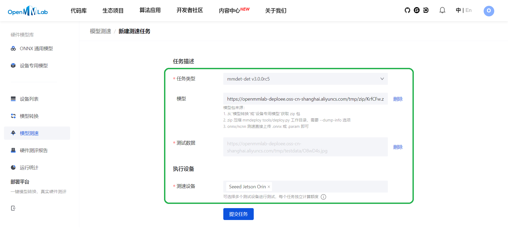

# 目标检测模型调优及部署到NVIDIA Jetson平台

# 1 项目介绍

本项目实现了对目标检测模型的微调，功能测试，以及在NVIDIA Jetson 平台上的部署和速度测试。

本项目在[北京超级云计算中心](https://cloud.blsc.cn/)平台上微调目标检测模型[RTMDet](https://github.com/open-mmlab/mmdetection/tree/v3.0.0rc5/configs/rtmdet)，并进行功能测试。然后使用OpenMMLab的[deploee](https://platform.openmmlab.com/deploee?lang=zh-CN) 模型部署平台把模型从pth格式转化为onnx和tensorrt格式，之后使用[deploee](https://platform.openmmlab.com/deploee?lang=zh-CN) 上的NVIDIA Jetson平台进行速度测试。最后进行了MMDeploy模型转换的源码分析。

- 项目任务详细： [点击](https://github.com/open-mmlab/OpenMMLabCamp/discussions/562)
- Github 仓库链接： [点击](https://github.com/jiongjiongli/mmdet_jetson)

# 2 模型选择

本项目选择了实时性和准确率都很高的一阶段[RTMDet](https://paperswithcode.com/paper/rtmdet-an-empirical-study-of-designing-real)作为base模型。

Base / Pretrained 模型文件：[点击](https://download.openmmlab.com/mmdetection/v3.0/rtmdet/rtmdet_tiny_8xb32-300e_coco/rtmdet_tiny_8xb32-300e_coco_20220902_112414-78e30dcc.pth)

# 3 环境准备

由于模型需要在NVIDIA Jetson 平台上部署，因此在 [北京超级云计算中心](https://cloud.blsc.cn/) 上搭建了与之相兼容的模型训练环境（注：NVIDIA Jetson 平台的兼容性要求需要在[deploee](https://platform.openmmlab.com/deploee?lang=zh-CN) 运行模型转化任务，然后下载模型，之后在下载的zip文件里的run.txt看到）。

本次环境准备步骤为：

1. 登陆 [北京超级云计算中心](https://cloud.blsc.cn/)

2. 运行bash命令（注意：其中git命令和pytorch安装需要访问外网，所以网络不稳定的时候会卡主，这时候建议预先下载好再上传）：

```
# 1. Download project code.
cd ~
git clone https://github.com/jiongjiongli/mmdet_jetson.git

# 2. Download mmdetection for model training.
cd ~/mmdet_jetson
git clone --branch v3.0.0rc5 https://github.com/open-mmlab/mmdetection.git

# 3. Download pretrained model.
mkdir ~/mmdet_jetson/model
wget -P ~/mmdet_jetson/model/ https://download.openmmlab.com/mmdetection/v3.0/rtmdet/rtmdet_tiny_8xb32-300e_coco/rtmdet_tiny_8xb32-300e_coco_20220902_112414-78e30dcc.pth

ln -s ~/mmdet_jetson/model ~/mmdet_jetson/mmdetection/model

# 4. Prepare python, cuda, gcc.
module avail
module load python/3.8.12-gcc-4.8.5-jbm
module load cuda/11.4.0-gcc-4.8.5-3cj
module load gcc/9.4.0-gcc-4.8.5

# 5. Create python 3.8 virtual environment.
python -m venv  ~/mmdet_jetson/py38
source ~/mmdet_jetson/py38/bin/activate

# 6. Install dependencies.
cd ~/mmdet_jetson
pip install --upgrade pip
pip install torch==1.11.0+cu113 torchvision==0.12.0+cu113 torchaudio==0.11.0 --extra-index-url https://download.pytorch.org/whl/cu113

pip install mmengine==0.7.1
pip install mmcv==2.0.0rc4 -f https://download.openmmlab.com/mmcv/dist/cu113/torch1.11/index.html

pip install mmdet==3.0.0rc5

pip install shapely
pip install numpy==1.23.1
```


# 4 数据集和数据处理

本项目选择的数据集为74张气球图片，其中61张作为训练集，13张作为验证和测试集。


由于数据标注文件是via格式的，因此需要转化为coco格式。

数据处理的命令为：

```
# 1. Download data.
mkdir ~/mmdet_jetson/data
wget -P ~/mmdet_jetson/data/ https://download.openmmlab.com/mmyolo/data/balloon_dataset.zip
cd ~/mmdet_jetson/data
unzip balloon_dataset.zip

# 2. Convert via format to coco.
cd ~/mmdet_jetson
python prepare_data.py

ln -s ~/mmdet_jetson/data ~/mmdet_jetson/mmdetection/data
```


# 5 模型训练与功能测试

## 5.1 模型训练

由于训练数据较少，所以只训练了40轮，对其他部分训练参数也进行了调整。

训练命令为：

```
cp ~/mmdet_jetson/rtmdet_tiny_1xb12-40e_balloon.py ~/mmdet_jetson/mmdetection/configs/rtmdet/

cd ~/mmdet_jetson/mmdetection
python tools/train.py configs/rtmdet/rtmdet_tiny_1xb12-40e_balloon.py
```

主要生成以下两个文件，需要下载到自己的电脑上：

- 模型文件路径： `~/mmdet_jetson/mmdetection/work_dirs/rtmdet_tiny_1xb12-40e_balloon/epoch_40.pth`
- 模型训练配置文件路径（及没有`__base__`部分，后面模型转换部分会用到）：`~/mmdet_jetson/mmdetection/work_dirs/rtmdet_tiny_1xb12-40e_balloon/rtmdet_tiny_1xb12-40e_balloon.py`

## 5.2 功能测试

功能测试命令为：

```
# Base model AP test.
cd ~/mmdet_jetson/mmdetection
python tools/test.py configs/rtmdet/rtmdet_tiny_1xb12-40e_balloon.py model/rtmdet_tiny_8xb32-300e_coco_20220902_112414-78e30dcc.pth

# Finetuned model AP test.
cd ~/mmdet_jetson/mmdetection
python tools/test.py configs/rtmdet/rtmdet_tiny_1xb12-40e_balloon.py work_dirs/rtmdet_tiny_1xb12-40e_balloon/epoch_40.pth

```

Base模型功能测试结果为：

```
ONE (t=0.02s).
 Average Precision  (AP) @[ IoU=0.50:0.95 | area=   all | maxDets=100 ] = 0.185
 Average Precision  (AP) @[ IoU=0.50      | area=   all | maxDets=100 ] = 0.229
 Average Precision  (AP) @[ IoU=0.75      | area=   all | maxDets=100 ] = 0.215
 Average Precision  (AP) @[ IoU=0.50:0.95 | area= small | maxDets=100 ] = 0.000
 Average Precision  (AP) @[ IoU=0.50:0.95 | area=medium | maxDets=100 ] = 0.021
 Average Precision  (AP) @[ IoU=0.50:0.95 | area= large | maxDets=100 ] = 0.357
 Average Recall     (AR) @[ IoU=0.50:0.95 | area=   all | maxDets=  1 ] = 0.108
 Average Recall     (AR) @[ IoU=0.50:0.95 | area=   all | maxDets= 10 ] = 0.394
 Average Recall     (AR) @[ IoU=0.50:0.95 | area=   all | maxDets=100 ] = 0.520
 Average Recall     (AR) @[ IoU=0.50:0.95 | area= small | maxDets=100 ] = 0.000
 Average Recall     (AR) @[ IoU=0.50:0.95 | area=medium | maxDets=100 ] = 0.241
 Average Recall     (AR) @[ IoU=0.50:0.95 | area= large | maxDets=100 ] = 0.730
07/26 20:59:04 - mmengine - INFO - bbox_mAP_copypaste: 0.185 0.229 0.215 0.000 0.021 0.357
07/26 20:59:04 - mmengine - INFO - Epoch(test) [13/13]  coco/bbox_mAP: 0.1850  coco/bbox_mAP_50: 0.2290  coco/bbox_mAP_75: 0.2150  coco/bbox_mAP_s: 0.0000  coco/bbox_mAP_m: 0.0210  coco/bbox_mAP_l: 0.3570  data_time: 0.0280  time: 0.0637
```

训练后的模型功能测试结果为：

```
 Average Precision  (AP) @[ IoU=0.50:0.95 | area=   all | maxDets=100 ] = 0.700
 Average Precision  (AP) @[ IoU=0.50      | area=   all | maxDets=100 ] = 0.818
 Average Precision  (AP) @[ IoU=0.75      | area=   all | maxDets=100 ] = 0.776
 Average Precision  (AP) @[ IoU=0.50:0.95 | area= small | maxDets=100 ] = 0.025
 Average Precision  (AP) @[ IoU=0.50:0.95 | area=medium | maxDets=100 ] = 0.508
 Average Precision  (AP) @[ IoU=0.50:0.95 | area= large | maxDets=100 ] = 0.853
 Average Recall     (AR) @[ IoU=0.50:0.95 | area=   all | maxDets=  1 ] = 0.224
 Average Recall     (AR) @[ IoU=0.50:0.95 | area=   all | maxDets= 10 ] = 0.750
 Average Recall     (AR) @[ IoU=0.50:0.95 | area=   all | maxDets=100 ] = 0.782
 Average Recall     (AR) @[ IoU=0.50:0.95 | area= small | maxDets=100 ] = 0.200
 Average Recall     (AR) @[ IoU=0.50:0.95 | area=medium | maxDets=100 ] = 0.688
 Average Recall     (AR) @[ IoU=0.50:0.95 | area= large | maxDets=100 ] = 0.893
07/26 21:01:53 - mmengine - INFO - bbox_mAP_copypaste: 0.700 0.818 0.776 0.025 0.508 0.853
07/26 21:01:53 - mmengine - INFO - Epoch(test) [13/13]  coco/bbox_mAP: 0.7000  coco/bbox_mAP_50: 0.8180  coco/bbox_mAP_75: 0.7760  coco/bbox_mAP_s: 0.0250  coco/bbox_mAP_m: 0.5080  coco/bbox_mAP_l: 0.8530  data_time: 0.0266  time: 0.0626
```

可见训练后AP提升还是比较明显的，从Base模型的接近20%提升到了70%。

- 本次训练日志：[点击](./data/train/20230726_181747.log)
- Base模型本次功能测试日志：[点击](data/test/base/ap/20230726_205848.log)
- 训练后的模型本次功能测试日志：[点击](data/test/fine_tuned/ap/20230726_210139.log)

# 6 模型部署

## 6.1 模型转换

### 6.1.1 步骤

1 进入[模型转换页面](https://platform.openmmlab.com/deploee/task-convert-list)， 点击"模型转换"，点击“新建转换任务”。

2 输入内容如下图所示：


​	"OpenMMLab 算法"：选择"mmdet-det v3.0.0rc5"。

​	"模型训练配置"：上传步骤5.1下载的的模型训练配置文件。

​	"pth 下载地址"：上传步骤5.1下载的的模型文件。

​	"目标 runtime"：选择"jetson-orin+jetpack5.0.1"。

​	"input shape"：关。

​	文本框内输入：

```
[input]
min_shape = [1, 3, 640, 640]
opt_shape = [1, 3, 640, 640]
max_shape = [1, 3, 640, 640]
```

​	"SDK 部署"： 开。

​	"测试数据"：从步骤4的数据集中选择一张图片上传。

​	"自定义选项"：关。

3 点击"提交任务"，等待转换完成。

4 转换完成后，点击"下载模型"，下载zip文件。

### 6.1.2 结果文件列表

zip文件内的文件列表如下：

```
2Aw4Rt.py
deploy.json
detail.json
end2end.engine
end2end.onnx
output_pytorch.jpg
output_tensorrt.jpg
pipeline.json
Qijl_detection_tensorrt_static-640x640.py
run.txt
```

其中：

- "end2end.onnx"和"end2end.engine"为转换后的onnx模型文件和tensorrt模型文件。
- "output_pytorch.jpg"和"output_tensorrt.jpg"为pth模型和tensorrt模型测试的可视化结果。
- "run.txt"为日志。
- 其他为配置信息。

进一步分析其中的可视化结果：

- pth模型测试可视化结果：

- tensorrt模型测试可视化结果：

可见tensorrt格式依然保持了较高的准确率，几乎没有精度损失。

## 6.2 模型速度测试

### 6.2.1 步骤

1 进入[模型测速页面](https://platform.openmmlab.com/deploee/task-profile-list)， 点击"模型测速"，点击“新建测速任务”。

2 输入内容如下图所示：



​	任务类型：选择"mmdet-det v3.0.0rc5"。

​	模型：上传步骤6.1下载的zip文件。

​	测试数据：从步骤4的数据集中选择一张图片上传。

​	测速设备：选择"<span class="ant-select-selection-item-content">Seeed Jetson Orin</span>"。

3 点击"提交任务"，等待速度测试完成。

4 速度测试完成后，点击"查看测速报告"。

### 6.2.2 测试结果

测速报告显示单张图片平均延迟为17毫秒，可见模型转换成tensorrt格式后达到了较快的推理速度。

```
========== cmd ==========
LD_LIBRARY_PATH=/tmp/aarch64-jetson-orin+jetpack5.0.1/install/lib:/tmp/aarch64-jetson-orin+jetpack5.0.1/install/ocv/lib:${LD_LIBRARY_PATH} /tmp/aarch64-jetson-orin+jetpack5.0.1/install/bin/detector --device cuda /tmp/datadir /tmp/datadir/MLVCYD.jpg
========== stdout ==========
[2023-07-27 09:39:38.831] [mmdeploy] [info] [model.cpp:35] [DirectoryModel] Load model: "/tmp/datadir"
bbox 0, left=159.03, top=301.96, right=572.47, bottom=681.99, label=0, score=0.9956
bbox 1, left=465.58, top=18.28, right=976.45, bottom=519.03, label=0, score=0.9922
========== stderr ==========
None
========== analyze ==========
+-----------------------------+--------+-------+--------+--------+--------+--------+
|            name             | occupy | usage | n_call | t_mean | t_50%  | t_90%  |
+=============================+========+=======+========+========+========+========+
| ./Pipeline                  | -      | -     | 1      | 16.579 | 16.579 | 16.579 |
+-----------------------------+--------+-------+--------+--------+--------+--------+
|     Preprocess/Compose      | -      | -     | 1      | 5.080  | 5.080  | 5.080  |
+-----------------------------+--------+-------+--------+--------+--------+--------+
|         LoadImageFromFile   | 0.077  | 0.077 | 1      | 1.273  | 1.273  | 1.273  |
+-----------------------------+--------+-------+--------+--------+--------+--------+
|         Resize              | 0.035  | 0.035 | 1      | 0.574  | 0.574  | 0.574  |
+-----------------------------+--------+-------+--------+--------+--------+--------+
|         Pad                 | 0.001  | 0.001 | 1      | 0.013  | 0.013  | 0.013  |
+-----------------------------+--------+-------+--------+--------+--------+--------+
|         Normalize           | 0.100  | 0.100 | 1      | 1.656  | 1.656  | 1.656  |
+-----------------------------+--------+-------+--------+--------+--------+--------+
|         Pad                 | 0.001  | 0.001 | 1      | 0.015  | 0.015  | 0.015  |
+-----------------------------+--------+-------+--------+--------+--------+--------+
|         DefaultFormatBundle | 0.091  | 0.091 | 1      | 1.511  | 1.511  | 1.511  |
+-----------------------------+--------+-------+--------+--------+--------+--------+
|         Collect             | 0.001  | 0.001 | 1      | 0.023  | 0.023  | 0.023  |
+-----------------------------+--------+-------+--------+--------+--------+--------+
|     rtmdet                  | 0.659  | 0.659 | 1      | 10.930 | 10.930 | 10.930 |
+-----------------------------+--------+-------+--------+--------+--------+--------+
|     postprocess             | 0.024  | 0.024 | 1      | 0.390  | 0.390  | 0.390  |
+-----------------------------+--------+-------+--------+--------+--------+--------+
```

本次测速报告详情：[点击](data/test/fine_tuned/speed/openmmlab-deploee.oss-cn-shanghai.aliyuncs.com_tmp_profile_speed_c749f4.txt)

# 7 MMDeploy模型转换源码分析

## 7.1 转换命令

```
python ./tools/deploy.py \
    ${DEPLOY_CFG_PATH} \
    ${MODEL_CFG_PATH} \
    ${MODEL_CHECKPOINT_PATH} \
    ${INPUT_IMG} \
    --test-img ${TEST_IMG} \
    --work-dir ${WORK_DIR} \
    --device ${DEVICE} \
    --log-level INFO \
    --show \
    --dump-info
```

## 7.2 部署配置信息 (Deploy config)

Deploy config由三部分组成：

- onnx_config：pth转换为onnx的配置信息。
- backend_config：onnx转化为各种backend格式（如tensorrt）的配置信息。
- codebase_config：模型推理配置信息。

若`DEPLOY_CFG_PATH=mmdeploy/configs/mmdet/detection/detection_tensorrt_static-300x300.py`，则`DEPLOY_CFG_PATH`生成的deploy config为：

| Key             |                             |                            |       |           | Value              |
| --------------- | --------------------------- | -------------------------- | ----- | --------- | ------------------ |
| backend_config  | type                        |                            |       |           | tensorrt           |
|                 | common_config               | fp16_mode                  |       |           | False              |
|                 |                             | max_workspace_size         |       |           | 1 << 30            |
|                 | model_inputs                | input_shapes               | input | min_shape | [1, 3, 300, 300]   |
|                 |                             |                            |       | opt_shape | [1, 3, 300, 300]   |
|                 |                             |                            |       | max_shape | [1, 3, 300, 300]   |
| onnx_config     | type                        |                            |       |           | onnx               |
|                 | export_params               |                            |       |           | True               |
|                 | keep_initializers_as_inputs |                            |       |           | False              |
|                 | opset_version               |                            |       |           | 11                 |
|                 | save_file                   |                            |       |           | end2end.onnx       |
|                 | input_names                 |                            |       |           | ['input']          |
|                 | output_names                |                            |       |           | ['dets', 'labels'] |
|                 | input_shape                 |                            |       |           | (300, 300)         |
|                 | optimize                    |                            |       |           | True               |
| codebase_config | type                        |                            |       |           | mmdet              |
|                 | task                        |                            |       |           | ObjectDetection    |
|                 | model_type                  |                            |       |           | end2end            |
|                 | post_processing             | score_threshold            |       |           | 0.05               |
|                 |                             | confidence_threshold       |       |           | 0.005              |
|                 |                             | iou_threshold              |       |           | 0.5                |
|                 |                             | max_output_boxes_per_class |       |           |                    |
|                 |                             | pre_top_k                  |       |           | 5000               |
|                 |                             | keep_top_k                 |       |           | 100                |
|                 |                             | background_label_id        |       |           | -1                 |

## 7.3 转换主流程

主流程如下，可见主要有两个部分，`torch2ir(ir_type)`实现把pth模型转换为onnx和`to_backend`用于把onnx模型转换为tensorrt。

```
# mmdeploy/tools/deploy.py

def main():

	deploy_cfg, model_cfg = load_config(deploy_cfg_path, model_cfg_path)
	
	# ir: intermediate representation, onnx or torchscript
	# ir_config or onnx_config
	ir_config = get_ir_config(deploy_cfg)
	
	# ir_type='onnx'
	# torch2ir('onnx')=torch2onnx
	# -> torch.onnx.export
    torch2ir(ir_type)(
        args.img,
        args.work_dir,
        ir_save_file,        # end2end.onnx
        deploy_cfg_path,
        model_cfg_path,
        checkpoint_path,
        device=args.device)

	# backend_files: onnx file path generated by method torch2ir
	backend_files = ir_files
    # backend=Backend.TENSORRT
    backend = get_backend(deploy_cfg)
    
    # onnx to tensorrt
    backend_files = to_backend(
        backend,
        ir_files,
        work_dir=args.work_dir,
        deploy_cfg=deploy_cfg,
        log_level=log_level,
        device=args.device,
        uri=args.uri)
        
    # onnx / tensorrt model test visualization.
    create_process(
        f'visualize {backend.value} model',
        target=visualize_model,
        args=(model_cfg_path, deploy_cfg_path, backend_files, args.test_img,
              args.device),
        kwargs=extra,
        ret_value=ret_value)

    # pth model test visualization.
    create_process(
        'visualize pytorch model',
        target=visualize_model,
        args=(model_cfg_path, deploy_cfg_path, [checkpoint_path],
              args.test_img, args.device),
        kwargs=dict(
            backend=Backend.PYTORCH,
            output_file=osp.join(args.work_dir, 'output_pytorch.jpg'),
            show_result=args.show),
        ret_value=ret_value)
```

# 8 总结和评估

本项目完成了目标检测调优与部署测试的整个流程，进行了功能测试和速度测试。测试结果显示，模型调优以后AP有了明显的提升（从接近20%提升到了70%），转换后的模型也达到了较快的推理速度（单张图片平均延迟为103毫秒）。最后进行了[MMDeploy](https://github.com/open-mmlab/mmdeploy)模型转换功能的源码分析，希望对大家深入了解[MMDeploy](https://github.com/open-mmlab/mmdeploy)有所帮助。

整个项目最耗时的部分是使用[deploee](https://platform.openmmlab.com/deploee?lang=zh-CN) 进行模型测速。因为[deploee](https://platform.openmmlab.com/deploee?lang=zh-CN) 还存在一些bug，也没有如何针对NVIDIA Jetson平台测速的的use case，所以使用起来不太方便。

# 9 致谢

本项目受到[OpenMMLab](https://github.com/open-mmlab)和[Seeed](https://wiki.seeedstudio.com/)多位老师的指导，在此表示衷心感谢！感谢[北京超级云计算中心](https://cloud.blsc.cn/)平台提供的算力，感谢Green，小喵的热情帮助，也感谢樛木同学的热情交流！
